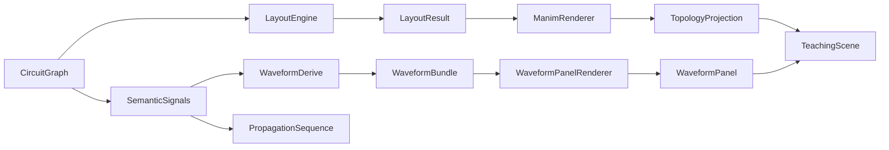

# ARCHITECTURE (for AI engineers)

## Layer ownership (hard rule)

```text
core -> semantic/protocol/waveform -> components/layout -> renderers -> animation -> examples
```

- Lower layers must not depend on upper layers.
- Semantics must not depend on Manim.
- Animation must not own topology or hidden engineering state.

## Runtime data flow



## Core abstractions and why they exist

- `CircuitGraph` (`core/graph.py`): explicit topology, deterministic connection IDs.
- `Port` (`core/port.py`): semantic endpoint identity (`owner_id.name`) contract.
- `Signal` (`semantic/signal.py`): state + propagation history, renderer-independent.
- `WaveformTrace/Bundle` (`waveform/trace.py`): semantic-time projection target.
- `LayoutResult` (`layout/types.py`): single geometry contract for renderers/scenes.
- `TopologyProjection` (`renderers/minimal/immutable.py`): animation-safe read-only topology groups.

## Scene/render/runtime relationship

- `LayoutEngine` computes geometry; renderer never re-solves topology.
- `MinimalRenderer` projects static geometry only.
- `WaveformPanelRenderer` draws time traces from `WaveformBundle`, not from ad-hoc scene logic.
- `WaveformDemoScene` orchestrates intro/HUD/beats/finalize; subclasses provide fixture and beats.

## Object lifecycle (waveform teaching scene)

1. Build fixture (`graph`, `elements`, `layout`, `bundle`, `signals`).
2. Render topology and waveform panel (`idle_only=True`).
3. Camera framing.
4. Intro stage (components/wires/panel chrome).
5. Optional baseline reveal.
6. Beat loop: propagation + timing + reveal in same beat run_time.
7. Optional finalize hold extension.
8. Outro fade (gated by env).

## Mutation boundaries

- Allowed semantic mutation: `Signal.propagate(...)` and protocol controllers.
- Allowed geometry mutation: `WaveformRevealTracker` segment append within panel trace groups.
- Forbidden mutation: renderer mutating semantics, animation rewriting graph topology.

## Architectural debt currently accepted

- Intro baseline path and beat reveal path are separate orchestration paths.
- `WaveformSegmentController` exists as facade but full controller-driven call sites are incomplete.
- Some compatibility APIs remain for transition safety (do not remove without test migration).

